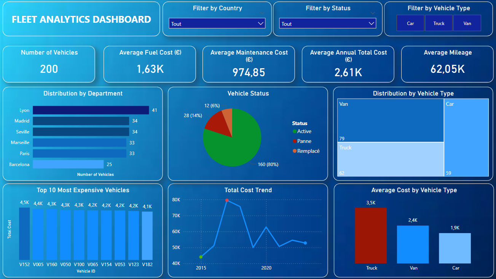
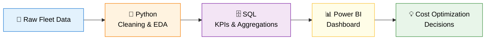

<div align="center">

# 🚛 Fleet Analytics
### Cost Optimization & Operational Efficiency

[]()
[]()
[]()
[]()
[]()

*Data-driven decisions for a 200-vehicle fleet across France & Spain*

</div>

---

## 📑 Table of Contents

- [Overview](#-overview)
- [Business Objectives](#-business-objectives)
- [Tech Stack](#️-tech-stack)
- [Project Workflow](#-project-workflow)
- [Repository Structure](#-repository-structure)
- [Analytical Layers](#-analytical-layers)
  - [Python — Data Exploration & Cleaning](#1️⃣-python--data-exploration--cleaning)
  - [SQL — KPI Analysis](#2️⃣-sql--kpi-analysis--operational-insights)
  - [Power BI — Dashboard](#3️⃣-power-bi--operational-monitoring)
- [Key Insights](#-key-insights)
- [Business Impact](#-business-impact)
- [Conclusion](#-conclusion)

---

## 🎯 Overview

This project analyzes a fleet of **200 vehicles operating across France and Spain** to identify key cost drivers and operational inefficiencies.

The objective is to support **cost reduction and fleet optimization decisions** through a full data pipeline combining Python, SQL, and Power BI.

> **Outcome at a glance**
> - 🚚 Identified **vehicle type** as the main cost driver
> - 🌍 Quantified impact of **geography & usage** on costs
> - ⚠️ Highlighted **inefficiencies** in fleet allocation
> - 📊 Built an **operational dashboard** for cost monitoring

---

## 📊 Dashboard Preview

The final deliverable is an interactive Power BI dashboard designed for operational fleet monitoring.



---

## 🧭 Business Objectives

In a context of rising logistics and fuel costs, the company aims to:

| Objective | Goal |
|-----------|------|
| 💰 **Cost Reduction** | Reduce fleet operating expenses |
| ⚙️ **Utilization** | Improve vehicle utilization & availability |
| 🗺️ **Allocation** | Optimize allocation across departments and regions |
| 🔎 **Targeting** | Identify high-cost vehicles and inefficiencies |

---

## 🛠️ Tech Stack

| Layer | Tool | Purpose |
|-------|------|---------|
| **Data Processing** | `Python` · `Pandas` · `NumPy` · `Matplotlib` · `Seaborn` | Cleaning & exploratory analysis |
| **Analytics Engine** | `SQL` | KPI extraction, aggregations, segmentation |
| **Visualization** | `Power BI` | Operational dashboarding |

---

## 🔄 Project Workflow



---

## 📂 Repository Structure

```
fleet-analytics/
│
├── 📁 Fleet_Analytics.ipynb          # Data cleaning & exploratory data analysis (Python)
├── 📁 Fleet_Data_Queries.sql         # SQL analysis (cost by vehicle type, availability rate, top expensive vehicles)
├── 📁 Fleet_Dashboard.pdf            # Power BI dashboard export
├── 📁 docs/                          # Screenshots & documentation
└── README.md
```

---

## 🔍 Analytical Layers

### 1️⃣ Python — Data Exploration & Cleaning

**Scope:** prepare and explore fleet data to understand the operational cost structure.

- ✅ Data cleaning and preprocessing
- ✅ Exploratory analysis of fleet composition
- ✅ Cost breakdown (fuel, maintenance, total cost)
- ✅ Initial identification of cost drivers

> **Findings**
> - Trucks are **significantly more expensive** than other vehicle types
> - Costs vary **strongly across departments**
> - Mileage impacts cost, but **less than vehicle type**

---

### 2️⃣ SQL — KPI Analysis & Operational Insights

**Scope:** transform raw fleet data into **actionable KPIs for decision-making**.

- 📊 Fleet distribution by vehicle type and department
- 💰 Total and average cost by vehicle category
- 🔧 Maintenance cost analysis
- ⏱️ Fleet availability rate
- 🔝 Identification of most expensive vehicles
- 📈 Global operational KPIs (mileage, fuel, maintenance)

> **Findings**
> - **Trucks** are the main cost driver
> - **Lyon and Paris** concentrate the highest costs
> - Fleet availability is **~80%**
> - A small number of vehicles generate **disproportionate costs**

---

### 3️⃣ Power BI — Operational Monitoring

A single-page dashboard providing a **global view of fleet performance and costs**.

| Component | Purpose |
|-----------|---------|
| 🚗 **Vehicle distribution by type** | Understand fleet composition |
| 🗺️ **Distribution by department** | Geographic cost concentration |
| 🟢 **Vehicle status** | Active vs. maintenance |
| 💶 **Average cost by vehicle type** | Identify expensive categories |
| 📈 **Total cost trend** | Time-based monitoring |
| 🔝 **Top 10 most expensive vehicles** | Targeted optimization |

> **Findings**
> - Trucks **dominate total cost structure**
> - Costs are **geographically concentrated**
> - Operational availability **directly impacts efficiency**
> - High-cost vehicles require **targeted monitoring**

---

## 💡 Key Insights

| # | Insight | Strategic Implication |
|---|---------|----------------------|
| 1 | **Trucks** are the dominant cost driver, with an average cost **~83% higher than cars** and **~47% higher than vans**, highlighting a strong cost disparity by vehicle type. | Reassess truck composition & alternatives |
| 2 | **Lyon and Paris** together account for **~37% of total operational costs**, making them the primary geographic cost centers despite an overall balanced distribution across regions. | Investigate regional cost patterns |
| 3 | Fleet availability is around **80%**, indicating potential inefficiencies in maintenance or vehicle downtime management. | Improve maintenance scheduling |
| 4 | A small subset of vehicles = **disproportionate costs** | Prioritize their replacement or optimization |

---

## 🚀 Business Impact

- 🎯 Identification of **key cost drivers** (vehicle type, geography)
- 🔄 Improved **fleet allocation strategy**
- 🔍 Detection of **high-cost vehicles** for optimization
- 📊 Better **operational monitoring** through dashboards
- 💰 Direct support for **cost reduction decisions**

---

## 🏁 Conclusion

This project demonstrates a full **end-to-end data analytics workflow** applied to fleet management:

- 🐍 **Python** for data preparation and exploration
- 🗄️ **SQL** for KPI extraction and operational analysis
- 📊 **Power BI** for decision-making dashboards

The analysis highlights that **vehicle type is the dominant cost driver**, and that meaningful optimization opportunities lie in **fleet composition and allocation strategies** rather than marginal usage adjustments.

<div align="center">

---

⭐ *If you found this project useful, feel free to star the repo!*

**Made with 💼 by Tony Aires**

</div>
